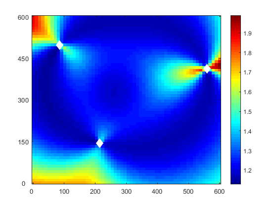
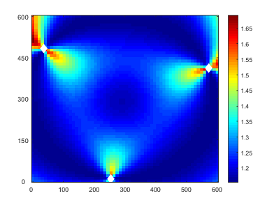
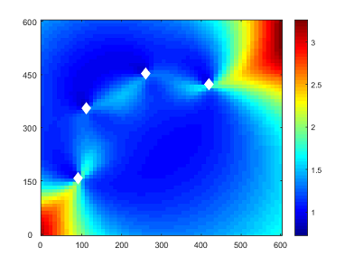
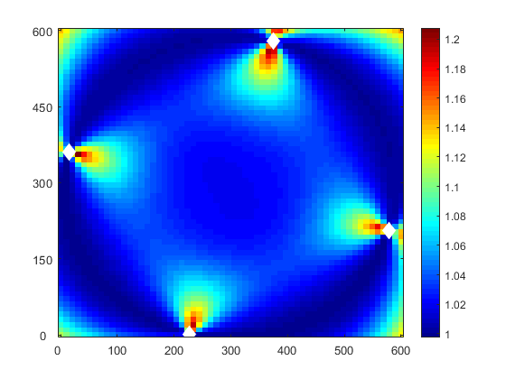
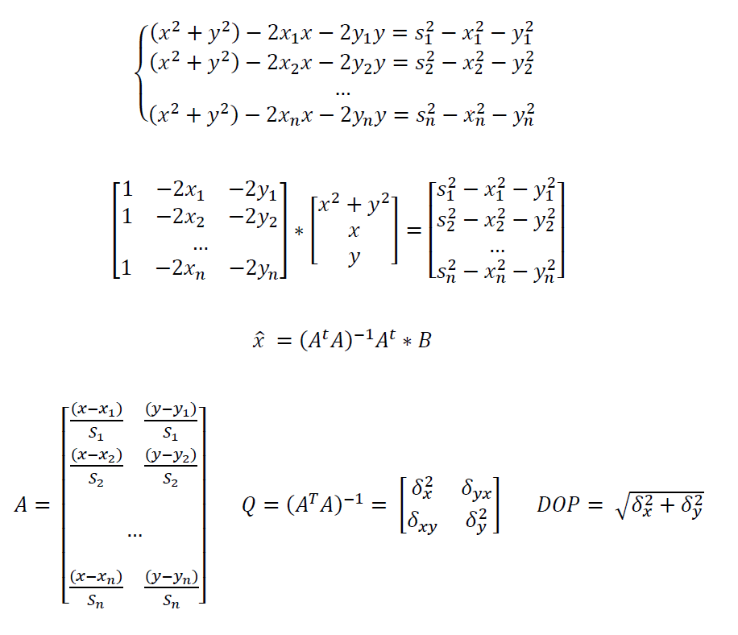

# RadioBeaconOptim

Optimization of *n* radio beacons positions on 2D plane used for navigation with algebraic multilateration algorithm using dillution of precision indicator.

## Examples

## Multilateration Equations

## Bibliography

 - Abdelmoumen Norrdine, "An Algebraic Solution to the Multilateration Problem"
 - John D'Errico, Fminsearchbnd - www.mathworks.com/matlabcentral/fileexchange/8277-fminsearchbnd-fminsearchcon
